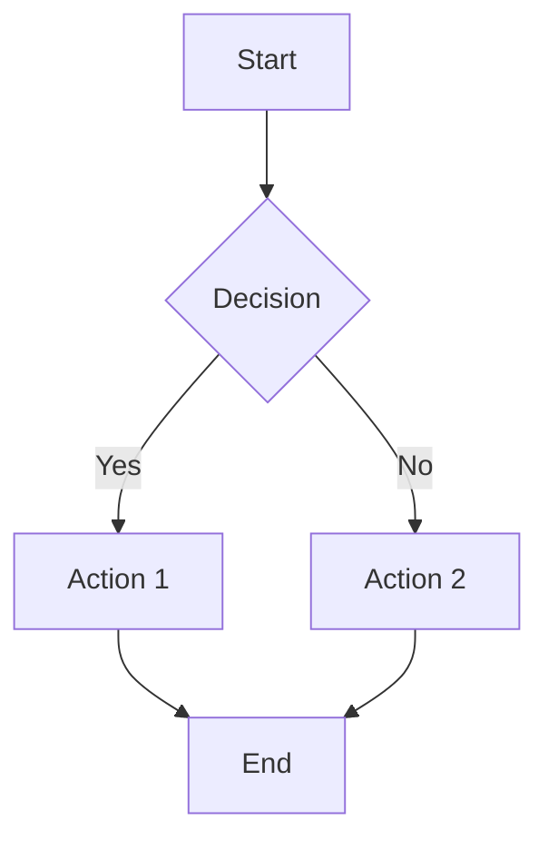

## Markdown Renderer Stress Test

This file exercises a wide range of Markdown syntax to verify renderer correctness. Each section targets a specific feature; if something looks wrong visually, the renderer has a bug in that area.

---

## Inline Formatting

This is **bold**, this is *italic*, this is ***bold italic***, this is ~~strikethrough~~, and this is `inline code`. Here's a [hyperlink](https://example.com "with title text") and an auto-link: <https://example.com>. Some renderers support ==highlighted text== and H~2~O subscript or x^2^ superscript.

Escaped special characters: \*not italic\*, \`not code\`, \[not a link\], \# not a heading.

---

## Headings

### Third Level

#### Fourth Level

##### Fifth Level

###### Sixth Level

Alternative H1
==============

Alternative H2
--------------

---

## Block Quotes

> Single-level blockquote with **bold** and `code` inside.

> Nested quotes:
>
> > Second level
> >
> > > Third level — does the indentation hold?

> Multi-paragraph blockquote.
>
> Second paragraph still inside the quote.

---

## Lists

### Unordered

- Item one
- Item two
  - Nested 2a
  - Nested 2b
    - Deep nested
- Item three

### Ordered

1. First
2. Second
   1. Sub-first
   2. Sub-second
3. Third

### Mixed

1. Ordered parent
   - Unordered child
   - Another child
     1. Back to ordered grandchild

### Task List

- [x] Completed task
- [ ] Incomplete task
- [x] Another done
  - [ ] Nested incomplete

### Loose vs Tight

- Tight item A
- Tight item B
- Tight item C

- Loose item A (paragraph spacing)

- Loose item B

- Loose item C

---

## Code Blocks

Indented code block (4 spaces):

    function hello() {
        return "world";
    }

Fenced code block with language hint:

```python
def fibonacci(n: int) -> int:
    """Calculate the nth Fibonacci number."""
    if n <= 1:
        return n
    a, b = 0, 1
    for _ in range(2, n + 1):
        a, b = b, a + b
    return b
```

Fenced block without language (should still render as code):

```
No syntax highlighting here.
Just plain preformatted text.
```

Fenced block with backtick fence (~~~):

~~~javascript
const x = [1, 2, 3].map(n => n * 2);
console.log(x); // [2, 4, 6]
~~~

Code block containing markdown syntax (should NOT be parsed):

```markdown
# This is inside a code block
**not bold** and [not a link](foo)
```

---

## Tables

| Left Aligned | Center Aligned | Right Aligned | Default |
|:-------------|:--------------:|--------------:|---------|
| Cell 1       | Cell 2         |        Cell 3 | Cell 4  |
| `code`       | **bold**       |    *italic*   | ~~del~~ |
| Long content that might wrap depending on renderer width | Short | 42 | OK |

Single column table:

| Header |
|--------|
| Value  |

---

## Horizontal Rules

Three different syntaxes (should all render identically):

---

***

___

---

## Links and Images

[Inline link](https://example.com)

[Link with title](https://example.com "Hover text")

[Reference-style link][ref1]

[ref1]: https://example.com "Reference 1"


[](https://example.com)

---

## HTML Inline (if supported)

<details>
<summary>Click to expand</summary>

This content is hidden by default in renderers that support HTML `<details>`.

- Nested markdown **inside** HTML should work.

</details>

<kbd>Ctrl</kbd> + <kbd>C</kbd> — keyboard shortcut styling.

<mark>Highlighted with mark tag</mark>

<dl>
  <dt>Definition Term</dt>
  <dd>Definition description using HTML dl/dt/dd.</dd>
</dl>

---

## Footnotes

Here's a sentence with a footnote[^1] and another one[^long].

[^1]: Short footnote content.

[^long]: Longer footnote with multiple paragraphs.

    Second paragraph of the footnote, indented to stay inside.

    Even a code block:

        x = 42

---

## Math (if supported)

Inline math: $E = mc^2$

Display math:

$$
\int_{-\infty}^{\infty} e^{-x^2} \, dx = \sqrt{\pi}
$$

$$
\begin{bmatrix}
1 & 2 & 3 \\
4 & 5 & 6
\end{bmatrix}
$$

---

## Emoji and Unicode

Shortcode emoji (if supported): :rocket: :white_check_mark: :warning:

Unicode emoji: 🚀 ✅ ⚠️ 🎉 💡

CJK characters: 你好世界 こんにちは 안녕하세요

RTL text: مرحبا بالعالم

---

## Edge Cases

### Emphasis ambiguity

*foo bar*baz — should "baz" be outside the emphasis?

**foo*bar** — mismatched delimiters.

_underscores_in_middle_of_word — varies by renderer (CommonMark: no emphasis).

### Line breaks

Line with two trailing spaces  
should create a hard break here.

Line with backslash\
also a hard break (CommonMark extension).

### Autolinks and bare URLs

https://example.com — some renderers auto-link bare URLs.

someone@example.com — some renderers auto-link emails.

### Deeply nested blockquote + list

> 1. First item in a quote
>    - Sub-bullet
>      > Nested quote inside list inside quote
>    - Another sub-bullet
> 2. Second item

### Consecutive code blocks (no blank line)

```
Block A
```
```
Block B
```

### Very long unbroken line

Thisisaverylongwordthathasnospacesandshouldforcetherenderertodecidewhetheritoverflowsscrollsorbreaks_ABCDEFGHIJKLMNOPQRSTUVWXYZ_0123456789_endofline.

### Pipe in table cell

| Expression | Result |
|-----------|--------|
| `a \| b`  | a or b |
| 1 \| 2    | 1 or 2 |

---

## Mermaid Diagram (if supported)



---

## Summary

If all sections above render correctly — headings, inline styles, lists (tight/loose/task), tables, code blocks, quotes, footnotes, math, HTML details, images, and edge cases — the renderer is handling the CommonMark spec plus popular extensions well.
